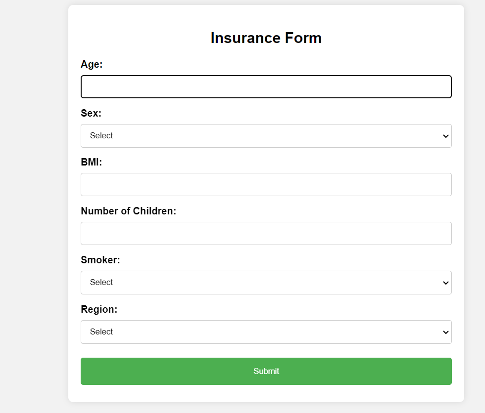

## Insurance Premium Prediction
### Demo Video:-
```bash
https://www.youtube.com/watch?v=ypIsFoGzY6o&t=7s
```




### Problem Statement:  
The goal of this project is to give people an estimate of how much they need based on 
their individual health situation. After that, customers can work with any health 
insurance carrier and its plans and perks while keeping the projected cost from our 
study in mind. This can assist a person in concentrating on the health side of an 
insurance policy rather han the ineffective part


### Dataset
```
The dataset used for training and testing the model consists of historical insurance data, including information about insured individuals such as age, gender, BMI, smoking status, region, and insurance premiums paid. It is divided into a training set and a test set to evaluate the performance of the predictive model.
```

### Methodology
```
The prediction model is built using a supervised learning approach, where various machine learning algorithms such as linear regression, decision trees, random forests, or gradient boosting are employed to predict insurance premiums. Feature engineering techniques may be applied to preprocess the data and extract relevant information for training the model.
```

### Usage
```
To use the insurance premium prediction model:


* Ensure you have Python installed on your system.
* Install the necessary Python libraries specified in the requirements.txt file.
* Run the provided Python script (app.py) after providing the required input data.
* The script will output the predicted insurance premiums for the given input.
 ```
 
### Evaluation

```
The performance of the prediction model is evaluated using metrics such as mean absolute error (MAE), mean squared error (MSE), and R-squared value on the test set. These metrics provide insights into the accuracy and reliability of the model in predicting insurance premiums.
```


### Future Work

```
Future enhancements to the insurance premium prediction model may include:
```


* Incorporating additional features such as medical history, occupation, or lifestyle factors.
* Fine-tuning hyperparameters of machine learning algorithms to improve prediction accuracy.
* Exploring advanced modeling techniques such as neural networks for more complex patterns in the data.


### Contributors
ABHISHEK UAPDHYAY


Feel free to modify and use this README template according to your project's specific requirements!


